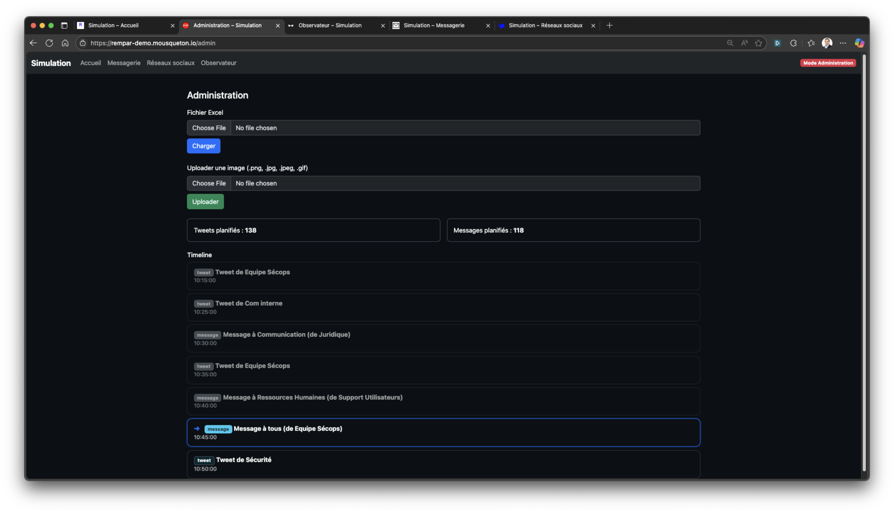
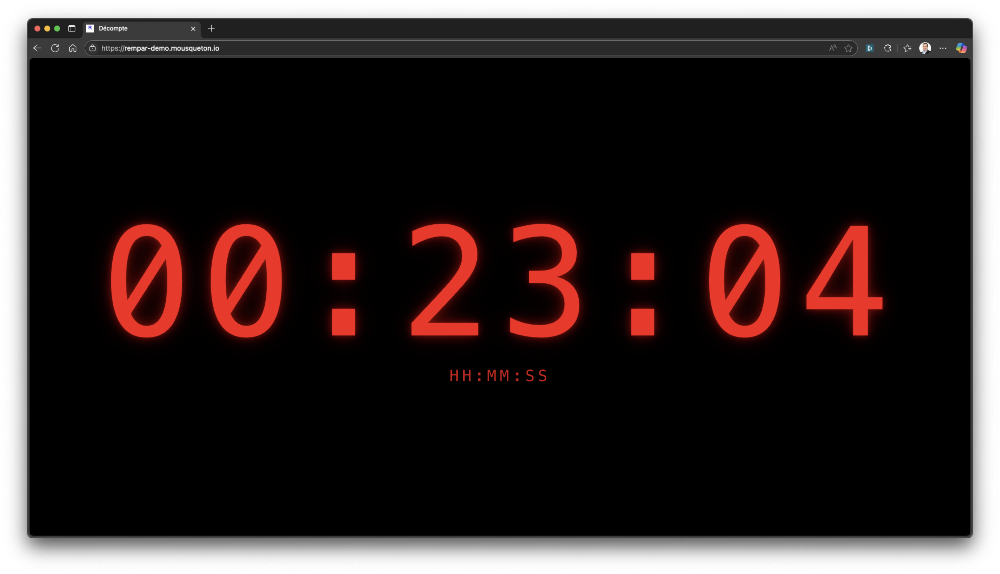

# 📄 Documentation

## 📂 Excel File Structure

The platform now uses **two separate Excel files**:

### 1️⃣ Chronogramme (`chronogramme.xlsx`)
This file contains **messages and countdown events**.

### 2️⃣ PMS (`pms.xlsx`) — *Optional*
This file contains **tweets** (social media).
- ⚠️ Requires `ENABLE_PMS=true` in the `.env` file
- If `ENABLE_PMS=false`, the social media module is disabled.

---

## ⚙️ Completing the Chronogramme File (`chronogramme.xlsx`)

This Excel file defines the **messages** and **countdowns** that will be automatically triggered during the simulation.

Each row corresponds to one event.

---

### 🗂️ Mandatory Columns

#### `id`
- **Only for messages.**
- Used to identify and order messages.
- Recommended format: **simple incremental numbering** (`001`, `002`, `003`, …).
- Example: `001` for the first message, `002` for the second, etc.
- **Note:** for countdowns, leave this cell empty.

---

#### `Horaire` (Time)
- Time when the event is triggered, in **HH:MM** or **HH:MM:SS** format.
- The current date is automatically used.
- Example: `09:15` will trigger the event at 9:15 a.m. (Paris time).

---

#### `Type`
- Type of stimulus expected:
  - `message` → arrival in the internal messaging system.
  - `decompte` → display of a countdown timer (duration in minutes defined in `Stimuli`).

**Note:** Tweets are now managed in the separate **`pms.xlsx`** file.

---

#### `Emetteur` (Sender)
- **Required** for messages.
- Name of the person or entity sending it.
- Example: `Management`, `CISO`, `Communication`.

---

#### `Destinataire` (Recipient)
- **Only for messages.**
- Corresponds to the target role(s) of the message.
- **Roles are dynamically extracted** from your recipients → no predefined list needed!
- Common examples:
  - `Communication`
  - `Decision`
  - `IT`
  - `Legal / Finance`
  - `Human Resources`
  - `Business`
  - `All` → message for **all roles**.

**💡 Multi-recipient support**: to send a message to multiple roles, list them on separate rows with the same `id`:

| id  | Horaire | Type    | Emetteur | Destinataire | Stimuli        |
|-----|---------|---------|----------|--------------|----------------|
| 003 | 10:00   | message | CISO     | IT           | Server down    |
| 003 | 10:00   | message | CISO     | Decision     | Server down    |

⚠️ **Alternative**: you can also use a line break in the same Excel cell to list multiple recipients.

---

#### `Stimuli` (Content)
- Content of the event.
- For a `message` → email body text.
- For a `decompte` → countdown duration in minutes (example: `15`).

---

### 📝 Optional Columns

These columns are intended for the **animator/facilitator** role only.

#### `Réaction attendue` (Expected Reaction)
- Indicates the desired response from participants.
- Example: *"Notify the communication team."*

#### `Commentaire` (Comment)
- Additional information for the exercise facilitators.

#### `Livrable` (Deliverable)
- Indicates an expected document.
- Example: *"Write a press release."*

---

### ✅ Example Table (Chronogramme)

| id   | Horaire | Type     | Emetteur      | Destinataire   | Stimuli                    | Expected Reaction              | Comment         | Deliverable       |
|------|---------|----------|---------------|----------------|----------------------------|--------------------------------|------------------|--------------------|
| 001  | 09:05   | message  | CISO          | IT             | Incident detected on server | Isolate the server             | Technical data   | Analysis report    |
|      | 09:10   | decompte |               |                | 15                         | Wait for countdown to end      | 15-min pause     |                    |
| 002  | 09:20   | message  | Management    | Communication  | Prepare official statement | Draft internal communication   | Check text       | Internal statement |
| 003  | 09:30   | message  | CISO          | All            | Situation update at 9:30   | Direct briefing                |                  |                    |

---

## ⚙️ Completing the PMS File (`pms.xlsx`)

This Excel file contains the **tweets** that will appear on the social media feed.

**⚠️ Prerequisite:** `ENABLE_PMS=true` in the `.env` file

### 🗂️ Mandatory Columns

#### `Horaire` (Time)
- Time when the tweet is published, in **HH:MM** or **HH:MM:SS** format.
- Example: `09:15`

#### `Emetteur` (Sender)
- **Required**.
- Simulated Twitter account (tweet author).
- Example: `News Journal`, `ANSSI Official`, `@CyberDefense`.

If `Emetteur` is set to `aléatoire` (random), a pseudonym will be randomly chosen from the `tweet.txt` file in the `static/data` directory.

If an image file named `Emetteur.png` or `Emetteur.jpg` exists in `static/images/tweet/`, it will be used as the avatar.

#### `Stimuli` (Content)
- Tweet content (hashtags allowed).
- **Tip: you can include an image** using the syntax:
  ```
  [img filename.png]
  ```
  Images must be stored in the **`static/images/`** folder.
  👉 They can be **uploaded directly via the admin interface** (*Upload image* section).
  
  Example: `New leak revealed! [img leak.png]`

### ✅ Example Table (PMS)

| Horaire | Emetteur      | Stimuli                                   |
|---------|---------------|-------------------------------------------|
| 09:00   | News Journal  | #Cyberattack in progress! [img leak.png] |
| 09:15   | @CyberDefense | Our experts are analyzing the situation  |
| 09:30   | ANSSI         | Security alerts level 3                  |

---

👉 With this structure, the simulation knows **what to trigger, when, and for whom**.


## 🖥️ User Interface

The application offers several web interfaces allowing participants and facilitators to monitor the exercise progress.

---

### 📌 Home Page (`/`)

- **General view** of the exercise.
- Displays:
  - Access links to different interfaces (Social Media, Messaging, Observer, Administration).
  - Scenario status (loaded or empty).
  - The **last 5 events** triggered (messages only).
- Serves as the entry point for participants.


---

### 🐦 Social Media (`/socialmedia`)

- Simulates a **Twitter-like feed**.
- Features:
  - Display of **tweets** scheduled in the scenario.
  - **Hashtag** support → trends update in real-time in the right column.
  - Ability to include **images** in tweets using the `[img name.png]` syntax.
  - Dynamic display of **retweets and likes count**, which evolve automatically.
  - Active hashtag filtering → clicking on a trending topic limits display to matching tweets.
- A clock (Paris time) is visible in the top right.


---

### ✉️ Messaging (`/messagerie`)

- Simulates an **internal messaging system** (Outlook/Webmail-like).
- Features:
  - Each participant chooses their **role** (Communication, Decision, IT, HR, etc.).
  - The inbox displays **messages addressed to that role**.
  - Messages can be **opened and read**.
  - Each message can be marked as **processed** ✅ (local storage, persistent per role).
  - History of the last 100 messages is available on load.
  - Real-time flow thanks to **SSE** (Server-Sent Events).


---

### 🔎 Animator (`/animateur`)

- Reserved for **animators/controllers**.
- Access via password (or pre-filled in demo mode).
- Features:
  - Summary view of **messages distributed**.
  - The **last 5 messages**.
  - The **next 2 scheduled messages**.
  - Display of **expected reactions** and **comments** defined in the Excel file.


---

### 👁️ Observer (`/observateur`)

- Reserved for **observers/evaluators**.
- Access via password.
- Features:
  - Focused view on **exercise stimuli (messages)**.
  - The **next message** is displayed at the top, grayed out and inactive until its scheduled time.
  - **Past messages** appear in reverse chronological order (most recent first).
  - For each stimulus, the observer can:
    - Give a **quick assessment** (👍 / 👎).
    - Add a **free comment**.
  - Notes are **automatically saved** locally (in browser).
  - Ability to **export** observations in **JSON** or **CSV** for analysis and debriefing.


---

### ⚙️ Administration (`/admin`)

- Reserved for **administrators** (password required).
- Features:
  - **Load the Chronogramme** (Excel file with messages and countdowns).
  - **Load the PMS** (Excel file with tweets) — optional if `ENABLE_PMS=true`.
  - View past and upcoming events.
  - **Upload images** (that can be used in tweets via `[img name.png]`).
  - Status indicators:
    - ✅ Chronogramme loaded / ❌ Empty
    - ✅ PMS loaded / ❌ Empty / ⊘ Disabled

  

---

### ⏳ Countdown

- When the scenario contains a **`decompte`** stimulus:
  - Player interfaces (Messaging and Social Media) automatically switch to a **full-screen countdown page**.
  - The home page also displays the countdown.
  - The timer is displayed with a red glowing effect.
  - After the countdown ends, the Messaging and Social Media interfaces return to normal automatically.



---

## ⚙️ `.env` File

The `.env` file allows you to configure the application without modifying the code.
It contains sensitive parameters (passwords, identifiers, secrets) and file paths.

**👉 See [env.example](../env.example) for a detailed description of all variables.**

### Details of Main Variables

#### Authentication
- **`ADMIN_PASSWORD`** : password to access the **Administration** interface.
- **`ANIMATOR_PASSWORD`** : password to access the **Animator** interface.
- **`OBSERVER_PASSWORD`** : password to access the **Observer** interface.

#### Global Configuration
- **`APP_ID`** : unique identifier for the simulation instance (useful for differentiating multiple environments).
- **`FLASK_SECRET`** : secret key used by Flask to manage user sessions (⚠️ must be **unique and complex**).
  - Generate a key: `python3 -c "import secrets; print(secrets.token_hex(32))"`
- **`TZ`** : application timezone (default: `Europe/Paris`).
- **`LANG`** : default language (default: `fr` for French, or `en` for English).
- **`PORT`** : application listening port (default: `5000`).

#### Scenario Files
- **`CHRONOGRAMME_FILE`** : path to the Excel file with **messages and countdowns** (default: `Sample/chronogramme.xlsx`).
- **`ENABLE_PMS`** : enables/disables the PMS module (tweets).
  - `true` → module active, `false` → module disabled.
- **`PMS_FILE`** : path to the Excel file with **tweets** (default: `Sample/pms.xlsx`, used if `ENABLE_PMS=true`).

#### Mode and Debugging
- **`DEBUG`** : enables Flask debug mode (⚠️ do not enable in production).
- **`DEMO`** : enables **demo mode**.
  - `true` → Animator and Observer passwords are pre-filled automatically.
  - Admin is inaccessible.
- **`TRACKING`** : allows adding an analytics tracking script (example: **Matomo**, Google Analytics…).
   - Content is injected as-is at the bottom of each page.
   - Typical example: a Matomo script hosted on an internal server.

👉 **Security tip**: never share the actual content of the `.env` file publicly (especially passwords and `FLASK_SECRET`).

---

### 🧪 Demo Mode

- A demonstration instance is available at:
  👉 [https://murail-demo.mousqueton.io](https://murail-demo.mousqueton.io)
- In this mode (`DEMO=true`):
  - The **Animator** password is pre-filled automatically.
  - The **Observer** password is pre-filled automatically.
  - **Admin** access is **disabled**.
  - Other features (Messaging, Social Media) remain accessible.
  - Allows easy testing of the interface without local configuration.
