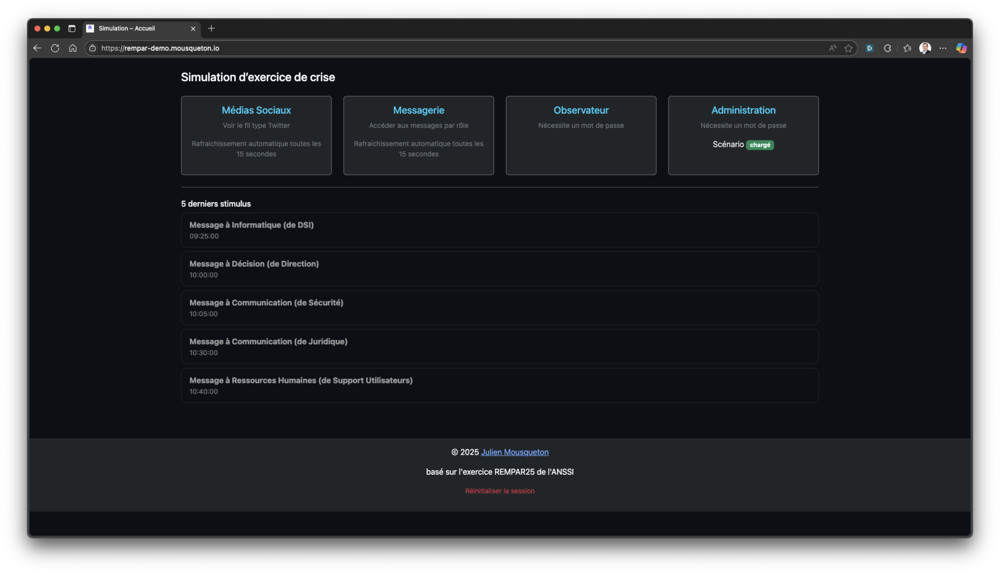
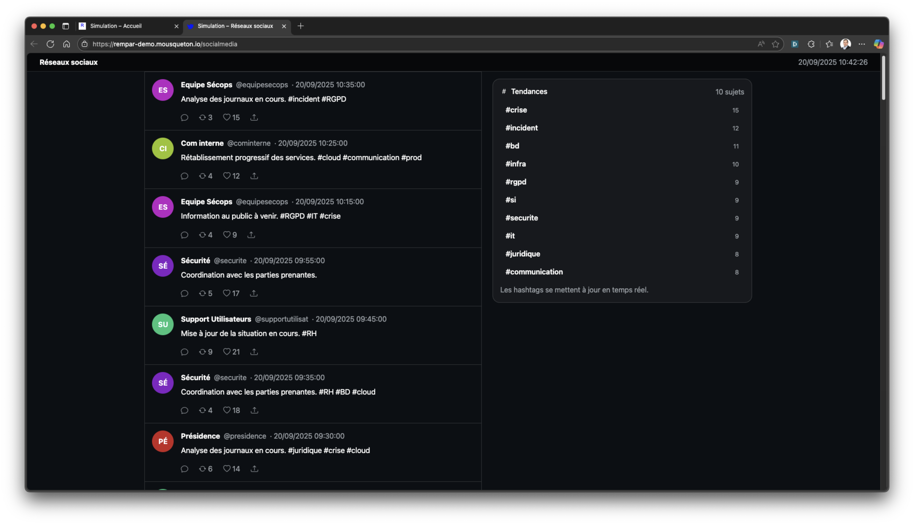
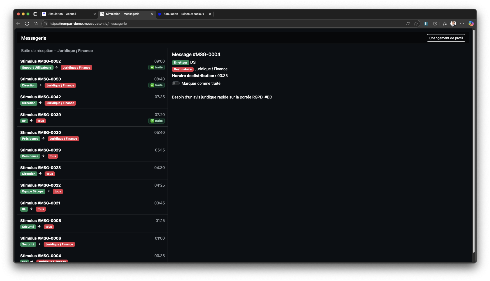
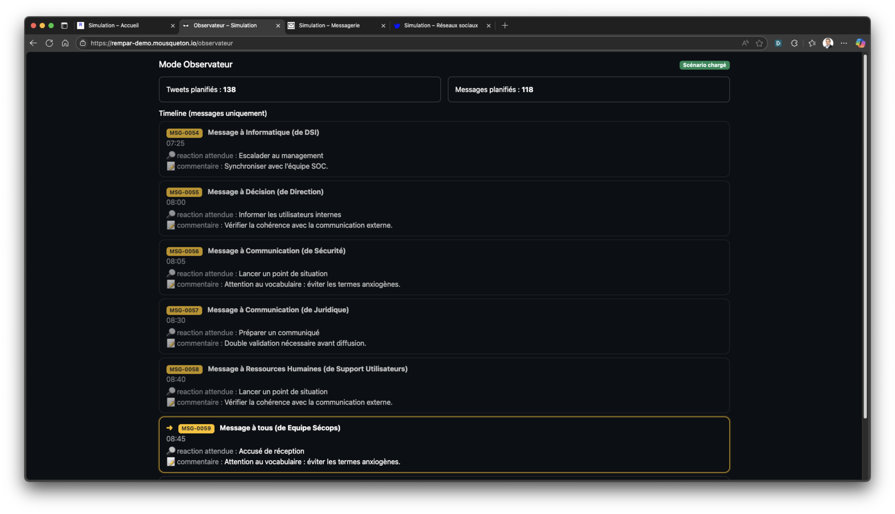
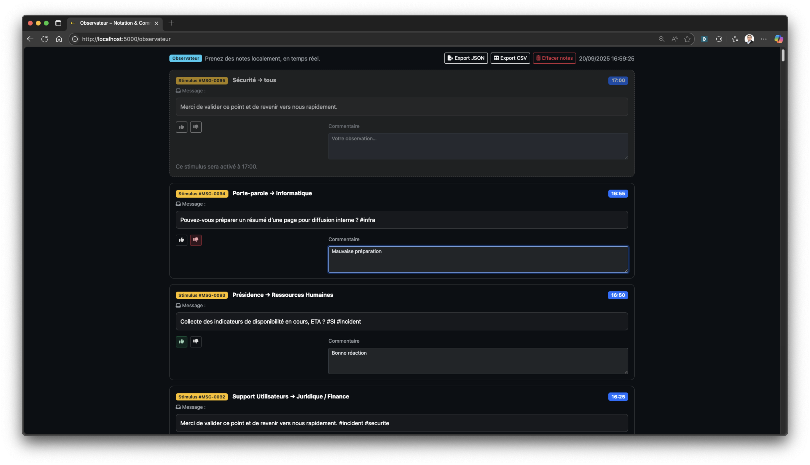
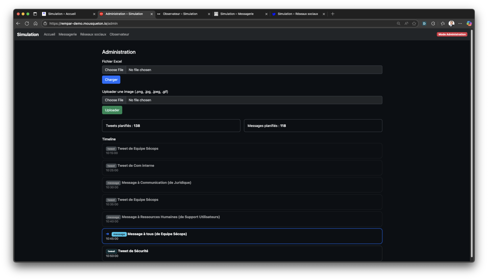

# 📄 Documentation


## ⚙️ Compléter le fichier Excel du scénario

Ce fichier Excel permet de définir les **stimuli** qui seront déclenchés automatiquement dans la simulation (tweets, messages ou décompte).

Chaque ligne correspond à un événement.

---

### 🗂️ Colonnes obligatoires

#### `id`
- **Uniquement pour les messages**.
- Sert à identifier et ordonner les messages.
- Format recommandé : **numérotation simple et croissante** (`001`, `002`, `003`, …).  
- Exemple : `001` pour le premier message, `002` pour le deuxième, etc.  
- **Attention :** pour les tweets ou les décomptes, laissez cette cellule vide.

---

#### `Horaire`
- Heure de déclenchement de l’événement au format **HH:MM**.
- La date du jour est automatiquement utilisée.
- Exemple : `09:15` déclenchera l’événement à 9h15 (heure de Paris).

---

#### `Type`
- Type de stimulus attendu :
  - `tweet` → publication sur le flux réseaux sociaux.
  - `message` → arrivée dans la messagerie.
  - `decompte` → affichage d’un compte à rebours (minutes définies dans `stimuli`).

---

#### `Emetteur`
- **Obligatoire** pour les `tweet` et les `message`.
- Nom de la personne ou entité qui envoie.
- Exemple : `Direction`, `RSSI`, `Journal Le Monde`.

---

#### `Destinataire`
- **Uniquement pour les messages**.
- Correspond au rôle cible du message :
  - `Communication`
  - `Décision`
  - `Informatique`
  - `Juridique / Finance`
  - `Ressources Humaines`
  - `Métier`
  - ou bien `Tous` pour un message général.

---

#### `Stimuli`
- Contenu de l’événement.
- Pour un `tweet` → texte du tweet (hashtags autorisés).  
  - **Astuce : vous pouvez insérer une image** en utilisant la syntaxe :  
    ```
    [img nom_du_fichier.png]
    ```
    Les images doivent être présentes dans le dossier **`static/images/`** du projet.  
    👉 Elles peuvent être **téléversées directement via l’interface d’administration** (section *Upload image*).  
    Exemple : `Nouvelle fuite révélée ! [img fuite.png]`
- Pour un `message` → texte du mail reçu.  
- Pour un `decompte` → durée du compte à rebours en minutes (exemple : `15`).

---

### 📝 Colonnes optionnelles

Ces colonnes sont uniquement à destination du role d'animateur/facillitateur 

#### `Réaction attendue`
- Indique la réponse souhaitée des participants.  
- Exemple : *"Prévenir le service communication"*.

#### `Commentaire`
- Informations complémentaires destinées aux animateurs de l’exercice.

#### `Livrable`
- Indique un document attendu (exemple : *"Rédiger un communiqué de presse"*).

---

### ✅ Exemple de tableau

| id   | Horaire | Type     | Emetteur      | Destinataire   | Stimuli                                   | Réaction attendue                  | Commentaire              | Livrable               |
|------|---------|----------|---------------|----------------|-------------------------------------------|------------------------------------|--------------------------|------------------------|
|      | 09:00   | tweet    | Journal Info  |                | #Cyberattaque en cours ! [img fuite.png]   | Analyser l’impact médiatique       | Premier tweet public     |                        |
| 001  | 09:05   | message  | RSSI          | Informatique   | Incident détecté sur serveur X             | Isoler le serveur                   | Données techniques       | Rapport d’analyse      |
|      | 09:10   | decompte |               |                | 15                                        | Attendre fin du décompte           | Pause simulation 15 min  |                        |
| 002  | 09:20   | message  | Direction     | Communication  | Préparer un communiqué officiel           | Élaborer une communication interne | Vérifier cohérence texte | Communiqué interne     |

---

👉 Avec cette structure, la simulation sait **quoi déclencher, quand, et pour qui**.


## 🖥️ Interface utilisateur

L’application REMPAR propose plusieurs interfaces web permettant aux participants et aux animateurs de suivre le déroulement de l’exercice.

---

### 📌 Page d’accueil (`/`)

- **Vue générale** de l’exercice.
- Affiche :
  - Les accès vers les différentes interfaces (Réseaux sociaux, Messagerie, Observateur, Administration).
  - Le statut du scénario (chargé ou vide).
  - Les **5 derniers événements** déclenchés (messages uniquement).
- Sert de point d’entrée pour les participants.



---

### 🐦 Réseaux sociaux (`/socialmedia`)

- Simule un **flux type Twitter**.
- Fonctionnalités :
  - Affichage des **tweets** programmés dans le scénario.
  - Support des **hashtags** → les tendances s’actualisent en temps réel dans la colonne de droite.
  - Possibilité d’inclure des **images** dans les tweets via la syntaxe `[img nom.png]`.
  - Affichage dynamique du **nombre de retweets et de likes**, qui évoluent automatiquement.
  - Filtrage par hashtag actif → cliquer sur un sujet de tendance limite l’affichage aux tweets correspondants.
- Une horloge (heure de Paris) est visible en haut à droite.



---

### ✉️ Messagerie (`/messagerie`)

- Simule une **messagerie interne** (type Outlook / Webmail).
- Fonctionnalités :
  - Chaque participant choisit son **rôle** (Communication, Décision, Informatique, RH, etc.).
  - La boîte de réception affiche les **messages adressés à ce rôle**.
  - Les messages peuvent être **ouverts et consultés**.
  - Chaque message peut être marqué comme **traité** ✅ (stockage local, persistant par rôle).
  - L’historique des 100 derniers messages est disponible au chargement.
  - Flux en temps réel grâce au **SSE** (Server-Sent Events).



---

### 🔎 Animateur (`/animateur`)

- Réservé aux **animateurs / contrôleurs**.
- Accès via mot de passe (ou prérempli en mode démo).
- Fonctionnalités :
  - Vue synthétique des **messages diffusés**.
  - Les **5 derniers messages**.
  - Les **2 prochains messages** programmés.
  - Affichage des **réactions attendues** et **commentaires** définis dans le fichier Excel.



---

### 👁️ Observateur (`/observateur`)

- Réservé aux **observateurs / évaluateurs**.  
- Accès via mot de passe.  
- Fonctionnalités :  
  - Vue centrée sur les **stimuli (messages)** de l’exercice.  
  - Le **prochain message** est affiché en haut, grisé et inactif jusqu’à son horaire.  
  - Les **messages passés** apparaissent en ordre inverse chronologique (le plus récent en premier).  
  - Pour chaque stimulus, l’observateur peut :  
    - Donner une **appréciation rapide** (👍 / 👎).  
    - Ajouter un **commentaire libre**.  
  - Les notes sont **sauvegardées automatiquement** en local (navigateur).  
  - Possibilité d’**exporter** les observations en **JSON** ou **CSV** pour analyse et debriefing.  



---

### ⚙️ Administration (`/admin`)

- Réservée aux **animateurs** (mot de passe requis).
- Fonctionnalités :
  - **Charger un scénario** (fichier Excel).
  - Voir les événements passés et futurs.
  - **Téléverser des images** (qui pourront être utilisées dans les tweets via `[img nom.png]`).
  - Indicateur si un scénario est chargé ou non.

  

---

### ⏳ Décompte

- Lorsque le scénario contient un stimulus de type **`decompte`** :
  - Les interfaces du joueur (Messagerie et Médias Sociaux) basculent automatiquement vers une **page de compte à rebours plein écran**.
  - La page d'accueil affiche aussi le décompte 
  - Le minuteur s’affiche avec un effet lumineux rouge.
  - À la fin du décompte, les interfaces Messagerie et Réseaux Sociaux  reviennent à la normale automatiquement.


---

## ⚙️ Fichier `.env`

Le fichier `.env` permet de configurer l’application sans modifier le code.  
Il contient les paramètres sensibles (mots de passe, identifiants, secrets) et les chemins de fichiers.  

### Détails des variables

- **`ADMIN_PASSWORD`** : mot de passe nécessaire pour accéder à l’interface **Administration**.  
- **`OBSERVER_PASSWORD`** : mot de passe pour accéder à l’interface **Observateur**.
- **`ANIMATOR_PASSWORD`** : mot de passe pour accéder à l’interface **Animateur**.
- **`APP_ID`** : identifiant unique de l’instance de simulation (utile pour différencier plusieurs environnements).  
- **`FLASK_SECRET`** : clé secrète utilisée par Flask pour gérer les sessions utilisateurs (⚠️ doit être unique et complexe).  
- **`SCENARIO_XLSX`** : chemin vers le fichier Excel contenant le **chronogramme** (par défaut : `./Sample/chronogramme.xlsx`).  
- **`DEMO`** : si `true`, active le **mode démo** (le mot de passe Observateur est pré-rempli automatiquement).  
- **`TRACKING`** : permet d’ajouter un script de suivi analytique (exemple : **Matomo**, Google Analytics…).  
   - Le contenu est injecté tel quel dans le bas de chaque page (`{{ TRACKING | safe }}`).  
   - Exemple typique : un script Matomo hébergé sur un serveur interne.  

👉 **Conseil sécurité** : ne jamais partager publiquement le contenu réel du fichier `.env` (surtout les mots de passe et `FLASK_SECRET`).   

--- 

### 🧪 Mode Démo

- Une instance de démonstration est disponible :  
  👉 [https://rempar-demo.mousqueton.io](https://rempar-demo.mousqueton.io)  
- Dans ce mode :
  - Le mot de passe Observateur est prérempli automatiquement.
  - Permet de tester facilement l’interface sans configuration locale.

